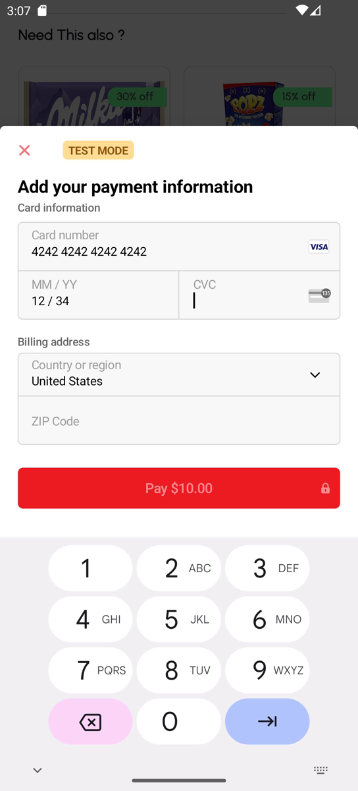

# 🛒 Smart Mart

Smart Mart is a mobile application designed to revolutionize the supermarket shopping experience.  
It connects directly to the supermarket basket system using a QR code scan and socket communication,  
allowing you to shop, view products in real-time, and pay instantly without waiting in checkout lines.

---

## 🚀 Features

- **Splash Screen**: Smooth introduction screen shown when opening the app.
- **Onboarding Screens**: Walkthrough of the app's main features for first-time users.
- **Login & Sign Up**: Secure user authentication with email and password.
- **Forgot Password**: Option to reset your password if you forget it.
- **OTP Verification**: One-Time Password screen for secure account verification.
- **QR Basket Connection**: Scan the QR code on the basket to start your shopping session.
- **Real-time Product Updates**: See products as they are added to your basket in real-time via socket communication.
- **Instant Mobile Payment**: Pay directly from your phone without standing in queues.
- **Home Page with Products**: Browse the supermarket's products directly from the app.
- **Wishlist**: Save your favorite products for future shopping.
- **Product Details & Recommendations**: View detailed information and recommended products.
- **Search**: Search for products by name or barcode scan.
- **Profile Page**: View and update your personal information, including profile picture.
- **Receipts Page**: View your past purchases with detailed transaction history.


---

## 📱 App Screenshots

<p align="center">
  
  
  
</p>

<p align="center">
  
  
  
</p>

<p align="center">
  
  
</p>


## 🎥 Demo Video
Watch the full demo of the app here: [View Demo Video](https://github.com/AmiraElrefaee/smart-mart-/releases/download/v1.0.0/demo.mp4)


---

## 🛠️ Tech Stack

- **Frontend**: Flutter
- **Backend Communication**: Socket.IO
- **Payments**: Mobile Payment Gateway Integration
- **Barcode/QR**: QR & Barcode Scanner Library

---

## 📦 Installation

1. Clone the repository:
   ```bash
   git clone https://github.com/YourUsername/smart_mart.git


- [Lab: Write your first Flutter app](https://docs.flutter.dev/get-started/codelab)
- [Cookbook: Useful Flutter samples](https://docs.flutter.dev/cookbook)

For help getting started with Flutter development, view the
[online documentation](https://docs.flutter.dev/), which offers tutorials,
samples, guidance on mobile development, and a full API reference.
